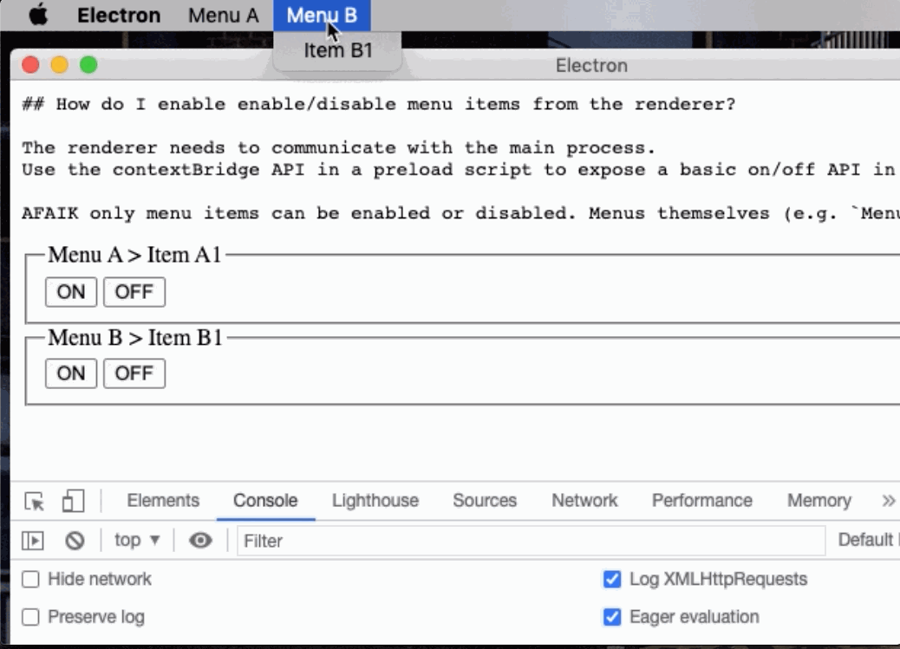

# Electron Menu Cookbook

A repository of examples using [Electron's Menu API](https://www.electronjs.org/docs/latest/api/menu) to do various things with native application menus. All examples work with Electron v15, `nodeIntegration` off and `contextIsolation` on.

To keep things small and focused we don't show how to load a renderer and setup a preload script from the main process.
We simply assume that you know how to do that. Have look at the  file if you're curious.

To run any of these examples just clone and `npm install` this repository and run the corresponding recipe script.


## How do I create a menu?

This can be as simple as describing your menu with with plain JavaScript data structures. This example adds two top menus "Stuff" and "Misc." each with their own submenu.

Please note that in macOS apps the first item of a menu is always the default application menu named after the application name and with the default submenu. This *can* be changed but requires extra work.

```shell
$ npm run reciple -- 01
```

```javascript
/*** main.js ***/

const {Menu} = require('electron');

module.exports = () => {
  Menu.setApplicationMenu(
    Menu.buildFromTemplate([
      {role: 'appMenu'}, // <- Warning: macOS-only role
      {label: 'Stuff', type: 'submenu', submenu: [
        {label: 'Do this'},
        {label: 'Do that'}]},
      {label: 'Misc.', type: 'submenu', submenu: [
        {label: 'Foo'},
        {label: 'Bar'},
        {label: 'Baz'}]}
      ]));
};
```


## How do I know when a user clicked on a menu item?

You can add a click handler on an item. The function receives the item clicked on as its first parameter.

```shell
$ npm run reciple -- 02
```

```javascript
/*** main.js ***/

const {Menu} = require('electron');

const click = menuitem => {
  console.log(`Click on ${menuitem.label}`);
}

module.exports = () => {
  Menu.setApplicationMenu(
    Menu.buildFromTemplate([
      {role: 'appMenu'}, // <- Warning: macOS-only role
      {label: 'Stuff', type: 'submenu', submenu: [
        {label: 'Submenu 1', click}]},
      {label: 'Misc.', type: 'submenu', submenu: [
        {label: 'Submenu 2', click}]}
      ]));
};
```


## How do I enable enable/disable menu items from the renderer?

The renderer needs to communicate with the main process.
Use the contextBridge API in a preload script to expose a basic on/off API in the renderer.

AFAIK only menu items can be enabled or disabled. Menus themselves (e.g. `Menu A`) cannot be disabled.

```shell
$ npm run reciple -- 03
```

```javascript
/*** main.js ***/

const {Menu, ipcMain} = require('electron');

module.exports = () => {
  const menu = Menu.buildFromTemplate([
    {role: 'appMenu'}, // <- Warning: macOS-only role

    {label: 'Menu A', type: 'submenu', submenu: [
      {id: 'item-a1', label: 'Item A1'}
    ]},

    {label: 'Menu B', type: 'submenu', submenu: [
      {id: 'item-b1', label: 'Item B1'}
    ]}
  ]);

  Menu.setApplicationMenu(menu);

  ipcMain.on('enable', (ev, id) => {
    menu.getMenuItemById(id).enabled = true;
  });

  ipcMain.on('disable', (ev, id) => {
    menu.getMenuItemById(id).enabled = false;
  });
};
```

```javascript
/*** preload.js ***/

const {contextBridge, ipcRenderer} = require('electron');

contextBridge.exposeInMainWorld('MY_APP', {
  enable(id) {
    ipcRenderer.send('enable', id);
  },
  disable(id) {
    ipcRenderer.send('disable', id);
  }
});
```

```html
<!-- index.html -->
<!-- FYI inlining event handlers is not great; this is only a demo -->
<fieldset>
  <legend>Menu A > Item A1</legend>
  <button onclick="MY_APP.enable('item-a1')">ON</button>
  <button onclick="MY_APP.disable('item-a1')">OFF</button>
</fieldset>
<fieldset>
  <legend>Menu B > Item B1</legend>
  <button onclick="MY_APP.enable('item-b1')">ON</button>
  <button onclick="MY_APP.disable('item-b1')">OFF</button>
</fieldset>
```



